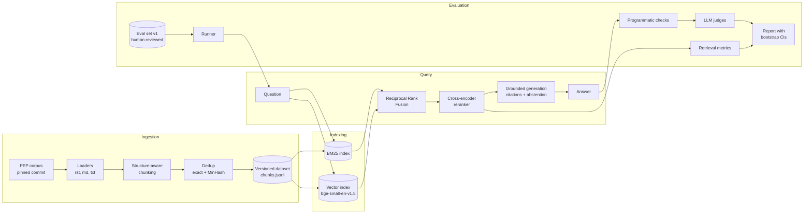
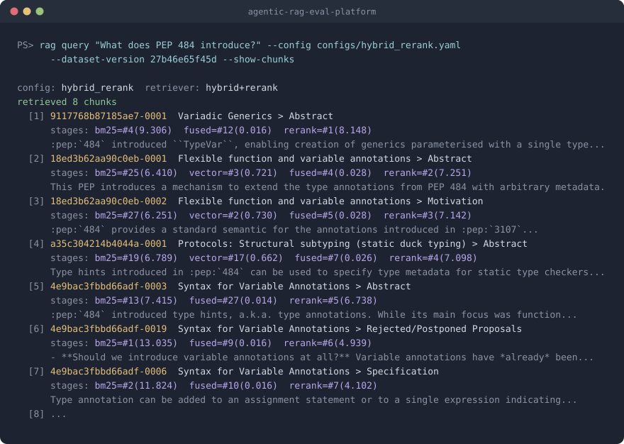
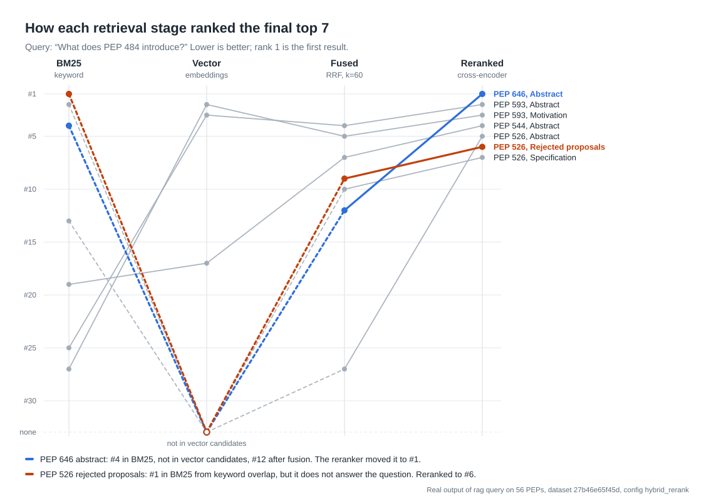

# agentic-rag-eval-platform

A production-style retrieval-augmented generation (RAG) system for technical documentation, built around one question: **how do you know it actually works?**

The platform combines structure-aware ingestion, hybrid BM25 and vector retrieval with reranking, grounded generation with citations, and an evaluation harness that measures retrieval and generation separately with confidence intervals. It uses 56 Python Enhancement Proposals (PEPs) as its corpus: public, well structured, and full of exact identifiers that stress keyword and semantic search in different ways.

The project is built in milestones. Milestones 1 to 5 are complete; the agent, data quality layer, production infrastructure and experiment report are in progress (see [Roadmap](#roadmap)).

---

## Contents

- [Why this project](#why-this-project)
- [Architecture](#architecture)
- [Example: hybrid retrieval with reranking](#example-hybrid-retrieval-with-reranking)
- [Quickstart](#quickstart)
- [Command reference](#command-reference)
- [Evaluation](#evaluation)
- [Engineering practices](#engineering-practices)
- [Project structure](#project-structure)
- [Roadmap](#roadmap)
- [License](#license)

---

## Why this project

Most RAG demos stop at "it answered my question." Real deployments fail in quieter ways: the right document is never retrieved, the answer cites a source that doesn't support it, or the system confidently answers a question the corpus can't answer.

This project treats those failures as measurable:

- **Retrieval and generation are evaluated separately**, so a bad answer can be traced to either a retrieval miss or a generation error.
- **Programmatic checks run before LLM judges**, because checks like citation validity and abstention correctness are cheap, deterministic and objective.
- **Every metric is reported with a bootstrap confidence interval**, and run comparisons use a paired bootstrap, so small differences aren't mistaken for improvements.
- **Every run is reproducible**, recording the config, git commit, dataset version, eval set version, prompt versions and models used.

---

## Architecture



### Ingestion

Documents are loaded with their title and heading hierarchy, then chunked in two passes: first by section headings, then recursively by paragraphs and sentences to a token budget (400 tokens by default, 15% overlap). Each chunk keeps its section path, for example `Specification > Syntax`, and character offsets that map back to the source.

Optionally, a contextual header (`document title > section path`) is prepended to the text used for indexing, while the original text is kept for display and generation. This helps short chunks that make no sense on their own.

Exact duplicates are removed by hash and near-duplicates with MinHash. On the PEP corpus this removed 53 identical copyright sections and 1 near-duplicate, producing 2,111 chunks.

The dataset version is a hash of the input manifest and the chunking config, so different chunking experiments never overwrite each other.

### Retrieval

| Stage | Implementation | Strength |
|---|---|---|
| Keyword search | BM25 (`rank_bm25`) with an identifier-preserving tokenizer | Exact terms such as `PEP 484` or `__future__` |
| Vector search | `BAAI/bge-small-en-v1.5`, normalized embeddings, exact cosine search | Meaning and paraphrase |
| Fusion | Reciprocal Rank Fusion, k = 60 | Merges lists by rank, avoiding incompatible score scales |
| Reranking | `cross-encoder/ms-marco-MiniLM-L-6-v2` | Reads question and chunk together for precise relevance |

Retrieval mode (`vector`, `bm25` or `hybrid`), candidate count, reranking and final result count are set in YAML configs under `configs/`.

### Generation

Retrieved chunks are passed to the model inside XML-delimited blocks with their chunk IDs. The model is instructed to answer only from that context, cite chunk IDs, and abstain when the context is insufficient. Output is validated with Pydantic, with one repair attempt on invalid output.

Programmatic safeguards run on every answer: citations that don't match a provided chunk are removed and flagged, and if retrieval returns nothing the system abstains without calling the model. Prompts are versioned files, and each answer records its prompt version, model and token usage.

---

## Example: hybrid retrieval with reranking

```powershell
rag query "What does PEP 484 introduce?" `
  --config configs/hybrid_rerank.yaml `
  --dataset-version 27b46e65f45d `
  --show-chunks
```

With `--show-chunks`, each result shows its rank and score at every retrieval stage, so you can see exactly why a chunk ended up where it did.



### What each stage contributes

Tracking the final top 7 through each stage shows that no single retriever would have produced this list on its own.



- **The reranker rescued a relevant chunk.** The PEP 646 abstract was only #12 after fusion and did not appear in the vector candidates at all. The cross-encoder moved it to #1.
- **The reranker demoted a keyword false positive.** BM25 ranked a "Rejected/Postponed Proposals" section of PEP 526 first because of keyword overlap, even though it doesn't answer the question. It finished at #6.

### A failure found during testing

For this query, every top result is a PEP that *cites* PEP 484, while PEP 484's own sections are not in the top 8. Rather than patching this from a single example, exact-term questions are tracked as their own category in the evaluation set, so the baseline can be measured and any fix compared against it with confidence intervals.

---

## Quickstart

### Requirements

- Python 3.11 or newer
- [uv](https://docs.astral.sh/uv/) for dependency management
- An Anthropic API key for generation, candidate question generation and LLM judges (retrieval works without one)

### Install

```bash
git clone https://github.com/<your-username>/agentic-rag-eval-platform.git
cd agentic-rag-eval-platform
uv sync --all-extras
```

On Windows, if `uv` isn't on your PATH, prefix commands with `py -m`, for example `py -m uv run rag query ...`.

### Configure

```bash
cp .env.example .env        # Windows: copy .env.example .env
```

Add your key to `.env`:

```text
ANTHROPIC_API_KEY=your-key-here
```

`.env` is gitignored. Never commit it.

### Build the corpus and indexes

```bash
uv run rag download-corpus     # 56 PEPs from python/peps, pinned commit, sha256 manifest
uv run rag ingest              # chunk, deduplicate, write a versioned dataset
uv run rag index               # build BM25 and vector indexes (about 13 minutes on CPU)
```

### Ask a question

```bash
uv run rag query "Why does Python need type hints when it is dynamically typed?" \
  --config configs/hybrid_rerank.yaml --show-chunks
```

### Run the checks

```bash
make check      # ruff, strict mypy, pytest
```

---

## Command reference

### Corpus, indexing and querying

| Command | Purpose |
|---|---|
| `rag download-corpus` | Download PEPs at a pinned commit and write a manifest with hashes |
| `rag ingest [--chunk-size N] [--overlap F]` | Chunk, deduplicate and write a versioned dataset |
| `rag index [--dataset-version V]` | Build BM25 and vector indexes for a dataset |
| `rag query "question" [--config PATH] [--dataset-version V] [--show-chunks]` | Retrieve and generate a grounded answer |

### Evaluation

| Command | Purpose |
|---|---|
| `rag eval generate-candidates --n 120` | Generate candidate questions from stratified chunks |
| `rag eval review <candidates.jsonl>` | Accept, edit or reject candidates; resumable |
| `rag eval run --config PATH --eval-set v1 [--limit N] [--retrieval-only] [--yes]` | Run an evaluation and write a run directory |
| `rag eval compare <run_a> <run_b>` | Compare two runs with paired bootstrap intervals |

### Development

| Command | Purpose |
|---|---|
| `make install` | Install dependencies |
| `make format` | Format code with ruff |
| `make lint` | Lint with ruff |
| `make typecheck` | Type check with strict mypy |
| `make test` | Run fast tests |
| `make check` | Lint, type check and test |
| `uv run pytest -m slow` | Run tests that download models |

---

## Evaluation

Full methodology is in [docs/evaluation.md](docs/evaluation.md).

### Building the evaluation set

1. **Generate candidates.** An LLM writes questions from chunks sampled across documents and question categories, including unanswerable questions about topics absent from the corpus.
2. **Human review.** Every candidate is reviewed against its source text and accepted, edited or rejected. Only reviewed items enter the evaluation set.
3. **Version it.** Reviewed items are stored in `eval_sets/v1/` and tracked in git.

Relevance is labeled by **document and section**, not by chunk ID, so labels stay valid when chunking changes. A retrieved chunk counts as relevant when it comes from a labeled section or a subsection of it.

### Question taxonomy

| Category | Tests |
|---|---|
| `lookup` | Finding a specific fact in one section |
| `conceptual` | Understanding the reasoning or motivation behind a feature |
| `exact_term` | Queries built around identifiers such as PEP numbers or names |
| `multi_hop` | Combining information from more than one section |
| `comparison` | Contrasting two features or proposals |
| `unanswerable` | Recognizing when the corpus does not contain the answer |

### Metrics

**Retrieval** (unanswerable items excluded): recall@k, precision@k, hit@k, MRR and nDCG@k.

**Generation**, in order of cost:

1. **Programmatic checks:** citation validity, correct abstention on unanswerable questions, missed abstention and unnecessary abstention.
2. **LLM judges**, each with a versioned prompt, structured and validated output, and evidence quotes before the verdict:
   - *Faithfulness:* the answer is split into atomic claims and each is checked against the retrieved context.
   - *Correctness:* binary verdict against the reference answer using an explicit rubric.
   - *Answer relevance:* binary verdict on whether the question was actually answered.

The judge model is configured separately from the generator model.

### Statistics

Every aggregate metric is reported with a seeded bootstrap 95% confidence interval. `rag eval compare` uses a paired bootstrap on the same items and states whether each difference is distinguishable from noise.

### Run outputs

Each run writes `experiments/runs/<timestamp>_<config>/` containing:

- `config.json` with the config snapshot, git commit and dirty flag, dataset and eval set versions, prompt versions and models
- `results.jsonl` with per-item retrieval, answer, checks and judge output
- `summary.json` with aggregate metrics and confidence intervals
- `report.md` with metrics by category and the worst failures, including retrieved sections and judge reasoning

LLM calls are cached on disk by model, prompt and parameters, and generation runs print estimated calls, tokens and cost before asking for confirmation.

### Results

Evaluation results will be published here once eval set v1 review is complete. Numbers are only reported from actual runs on the reviewed set.

---

## Engineering practices

- **Typed throughout:** strict mypy, Pydantic models at every boundary.
- **Tested:** 148 fast tests run offline with mocked LLM calls; slow tests that download models are marked and run separately.
- **Reproducible:** pinned corpus commit, content-hashed dataset versions, versioned prompts and eval sets, and full run metadata.
- **Pluggable components:** loaders, embedders, vector stores, rerankers and LLM providers sit behind protocols.
- **Cost aware:** disk caching of LLM calls, cost estimates from a pricing config, and `--limit` for small trial runs.
- **Safe configuration:** secrets come from environment variables and `.env` is never committed.
- **Continuous integration:** GitHub Actions runs lint, type checking and tests on every push and pull request.

---

## Project structure

```text
agentic-rag-eval-platform/
├── src/ragplatform/
│   ├── cli/              # typer commands: ingest, retrieval, eval
│   ├── ingestion/        # corpus download, loaders, chunking, dedup, datasets
│   ├── retrieval/        # embedder, vector store, BM25, fusion, reranker, hybrid
│   ├── generation/       # grounded answer generation
│   ├── llm/              # provider interface, Anthropic provider, cache, pricing
│   ├── evals/            # eval sets, metrics, checks, judges, bootstrap, runner, reports
│   ├── prompts/          # versioned prompt files
│   ├── pipelines/        # run configuration
│   ├── agent/            # tool-using agent (planned)
│   ├── data_quality/     # failure taxonomy and annotation (planned)
│   ├── api/              # FastAPI service (planned)
│   ├── observability/    # logging and tracing (planned)
│   ├── config.py
│   └── models.py
├── configs/              # retrieval configs and pricing
├── eval_sets/            # question taxonomy and versioned eval sets
├── experiments/          # run outputs (gitignored)
├── data/                 # raw corpus and processed datasets (gitignored)
├── docs/                 # architecture, evaluation methodology, images
├── scripts/              # corpus download
├── tests/                # mirrors the package structure
├── .github/workflows/    # CI
├── CLAUDE.md             # project conventions
├── Makefile
└── pyproject.toml
```

---

## Roadmap

- [x] **M1 Foundation:** project structure, tooling, CI and documentation
- [x] **M2 Ingestion:** document loading, structure-aware chunking, metadata and deduplication
- [x] **M3 Retrieval:** embeddings, vector store, BM25, Reciprocal Rank Fusion and reranking
- [x] **M4 Generation:** grounded answers with citations and abstention
- [x] **M5 Evaluation harness:** eval set workflow, retrieval metrics, LLM judges and bootstrap confidence intervals
- [ ] **M6 Agent:** tool-using agent loop, multi-turn query rewriting, trajectory logging, pass@k and pass^k
- [ ] **M7 Data quality:** failure taxonomy, annotation workflow, Cohen's kappa and judge-human agreement
- [ ] **M8 Infrastructure:** async batch runner with retries, tracing, FastAPI service and Docker
- [ ] **M9 Experiments:** chunking, retrieval and reranking ablations with a results report

---

## License

MIT. See [LICENSE](LICENSE).

The PEP corpus is downloaded at runtime from [python/peps](https://github.com/python/peps) and is not redistributed in this repository.