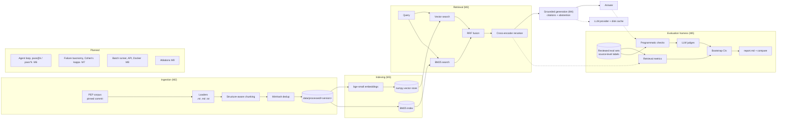

# agentic-rag-eval-platform

[](https://github.com/evangelosvlachos/agentic-rag-eval-platform/actions/workflows/ci.yml)
[](https://www.python.org/)
[](LICENSE)

A production-style agentic RAG system with hybrid retrieval, reranking, a
tool-using agent, and a rigorous evaluation and data-quality layer. Most RAG
demos stop at "it answered the question"; this project exists to show the other
half of the job: measuring retrieval and generation separately, calibrating LLM
judges against human labels, quantifying agent reliability with pass^k, and
running ablations whose results you can actually trust. It is built as a
portfolio piece for applied-AI / forward-deployed engineering work, with the
same tooling discipline you would want in a real deployment.

> **Status:** Milestones 1 to 5 are implemented and tested: a pinned PEP
> corpus, structure-aware ingestion, hybrid retrieval with reranking, grounded
> generation, and the evaluation harness. The real eval set has **not** been
> built yet and no evaluation numbers exist; every run so far is a pipeline
> smoke test on a three-document fixture corpus. The agent (M6) onward is planned.

## Architecture



Full diagram and design notes: [docs/architecture.md](docs/architecture.md).
Evaluation methodology: [docs/evaluation.md](docs/evaluation.md).

## Roadmap

### Milestone 1: Foundation
- [x] `src` layout with `ragplatform` package and documented subpackages
- [x] `uv` project with light base install and optional `retrieval` / `eval` / `api` extras
- [x] Settings via pydantic-settings loading from `.env`
- [x] Core pydantic models: `Document`, `Chunk`, `RetrievedChunk`, `Citation`, `Answer`
- [x] ruff, strict mypy, pytest, pre-commit
- [x] Makefile (`install`, `lint`, `format`, `typecheck`, `test`, `check`)
- [x] GitHub Actions CI (lint, typecheck, tests on 3.11 and 3.12)
- [x] README, CLAUDE.md, architecture doc

### Milestone 2: Ingestion
- [x] Pinned PEP corpus download (56 PEPs from `python/peps` at one commit) with a content-hash manifest
- [x] Document loading for `.rst`, `.md` and `.txt` with title and heading hierarchy (HTML / PDF not planned)
- [x] Structure-aware chunking: sections, then paragraphs, then sentences, under a token budget with overlap
- [x] Chunk metadata (section path, offsets that map back to the source, token count, contextual header)
- [x] Exact and near-duplicate (MinHash LSH) detection
- [x] Content-versioned datasets: `data/processed/<dataset_version>/chunks.jsonl` + manifest

### Milestone 3: Retrieval
- [x] Pluggable embedder with local sentence-transformers default (`BAAI/bge-small-en-v1.5`), cached per dataset version
- [x] Vector store abstraction with an exact numpy implementation that saves and loads
- [x] BM25 lexical retrieval with an identifier-preserving tokenizer
- [x] Hybrid search with Reciprocal Rank Fusion
- [x] Cross-encoder reranking (`cross-encoder/ms-marco-MiniLM-L-6-v2`)
- [x] Per-stage scores and ranks on every retrieved chunk; YAML configs

### Milestone 4: Generation
- [x] LLM provider interface with async Anthropic client (SDK retries) and a fake provider for tests
- [x] Versioned prompt files; prompt version and model recorded in every answer
- [x] Grounded answers with validated citations (invalid ids removed and flagged)
- [x] Abstention when the context does not support an answer, without an LLM call when retrieval is empty
- [x] Structured JSON output validated with pydantic and one repair retry; disk cache for LLM calls

### Milestone 5: Evaluation harness
- [x] Eval item schema with source-level relevance labels and a versioned question taxonomy
- [x] Candidate generation and a resumable human review CLI
- [x] Retrieval metrics: recall@k, precision@k, hit@k, MRR, nDCG@k
- [x] Programmatic citation and abstention checks
- [x] LLM judges (faithfulness, correctness, relevance) with bias mitigations
- [x] Bootstrap confidence intervals and paired-bootstrap run comparison
- [ ] Eval set `v1` (60 to 100 reviewed items) and first real results

### Milestone 6: Agent
- [ ] Tool-using agent loop with a search tool
- [ ] Multi-turn query rewriting
- [ ] Step limits
- [ ] Trajectory logging
- [ ] pass@k and pass^k

### Milestone 7: Data quality
- [ ] Failure taxonomy
- [ ] Annotation export
- [ ] Cohen's kappa
- [ ] Judge-human agreement

### Milestone 8: Infrastructure
- [ ] Async batch runner with retries
- [ ] Tracing
- [ ] FastAPI service
- [ ] Docker

### Milestone 9: Experiments
- [ ] Chunking ablation
- [ ] Vector-only vs hybrid retrieval
- [ ] Reranking ablation
- [ ] Results report

## Quickstart

Requires Python 3.11+ and [uv](https://docs.astral.sh/uv/).

```bash
git clone https://github.com/evangelosvlachos/agentic-rag-eval-platform.git
cd agentic-rag-eval-platform

uv sync                     # base + dev dependencies, creates .venv
cp .env.example .env        # then set ANTHROPIC_API_KEY (not needed for make check)
make check                  # lint + typecheck + tests (148 tests, no network)
```

Optional extras, installed only when you need them:

```bash
uv sync --extra retrieval   # sentence-transformers + torch, needed for embeddings and reranking
uv sync --extra eval        # scipy (reserved for later milestones)
uv sync --extra api         # fastapi, uvicorn
uv run pytest -m slow       # the two tests that download the embedding and reranker models
```

On Windows without GNU make, run the commands from the `Makefile` directly, e.g.
`uv run ruff check .`, `uv run mypy`, `uv run pytest`.

## Usage

Every command below was run on this repository; the outputs are pasted as
produced (log lines trimmed).

### 1. Download the corpus

```
$ uv run rag download-corpus
Downloading 56 PEPs at python/peps@94a7775f23fd -> data\raw\peps
Downloaded 56 files (1823 KiB).
Manifest: data\raw\peps\manifest.json
```

All 56 requested PEPs exist at the pinned commit; none were skipped. The set
covers typing (484, 526, 544, 585, 604, 695, ...), async (492, 525, 530, 654),
packaging (427, 440, 517, 518, 621, 723, 735), language features (343, 380,
498, 572, 634-636, 701, 703) and process documents (1, 8, 20, 257, 594, 602).

### 2. Ingest: chunk and deduplicate

```
$ uv run rag ingest
... [info] dedup_complete   exact_removed=53 kept=2111 near_removed=1
... [info] ingest_complete  chunks=2111 dataset_version=27b46e65f45d documents=56 output_dir=data/processed/27b46e65f45d
dataset_version: 27b46e65f45d
documents: 56  chunks: 2111
removed: 53 exact, 1 near-duplicate
output: data\processed\27b46e65f45d
```

The 53 exact duplicates are the identical "Copyright" sections every PEP ends
with. `--chunk-size` and `--overlap` change the dataset version, so different
chunkings live side by side.

### 3. Index: BM25 and embeddings

```
$ uv run rag index
... [info] bm25_index_built   chunks=2111
... [info] vector_index_built chunks=2111 model=BAAI/bge-small-en-v1.5
dataset_version: 27b46e65f45d  chunks: 2111
bm25: data\processed\27b46e65f45d\index\bm25.json
vectors: data\processed\27b46e65f45d\index\vectors_BAAI__bge-small-en-v1.5.npz (embedded)
```

Re-running reports `(reused cached embeddings)`. Embedding 2111 chunks on a
CPU took about 13 minutes; `--no-vectors` builds only BM25.

### 4. Query

Configs: `configs/bm25_only.yaml`, `vector_only.yaml`, `hybrid.yaml`,
`hybrid_rerank.yaml`. Each retrieved chunk shows its rank and score at every
stage. Generation ran with no `ANTHROPIC_API_KEY` set, so these show retrieval
only; with a key the grounded answer, citations and token usage follow.

Conceptual question:

```
$ uv run rag query "Why does Python need type hints when it is a dynamically typed language?" --show-chunks
config: hybrid_rerank  retriever: hybrid+rerank
retrieved 8 chunks
  [1] 24cedd106580f3ea-0004  Postponed Evaluation of Annotations > Rationale and Goals > Non-goals
      stages: bm25=#3(23.051)  vector=#2(0.854)  fused=#3(0.032)  rerank=#1(6.849)
      Just like in :pep:`484` and :pep:`526`, it should be emphasized that **Python will remain a dynamically typed language, and the authors have no desire to ever make type hints mandatory, even by convention.** ...
  [2] a25e032f504686c8-0004  Type Hints > Rationale and Goals > Non-goals
      stages: bm25=#2(24.144)  vector=#1(0.873)  fused=#1(0.033)  rerank=#2(6.550)
      While the proposed typing module will contain some building blocks for runtime type checking -- in particular the ``get_type_hints()`` function -- third party packages would have to be developed ...
  [3] 4e9bac3fbbd66adf-0005  Syntax for Variable Annotations > Rationale > Non-goals
      stages: bm25=#1(24.805)  vector=#3(0.848)  fused=#2(0.032)  rerank=#3(6.068)
  ...
generation skipped: ANTHROPIC_API_KEY is not set
```

Exact-term question about PEP 484:

```
$ uv run rag query "Which PEP introduced the typing module and what is the purpose of Any in PEP 484?" --show-chunks
config: hybrid_rerank  retriever: hybrid+rerank
retrieved 8 chunks
  [1] a35c304214b4044a-0001  Protocols: Structural subtyping (static duck typing) > Abstract
      stages: bm25=#9(27.086)  vector=#33(0.715)  fused=#9(0.025)  rerank=#1(5.380)
      Type hints introduced in :pep:`484` can be used to specify type metadata for static type checkers and other third party tools. ...
  [2] e26e4b478a435481-0001  Type Hinting Generics In Standard Collections > Abstract
      stages: bm25=#7(27.389)  vector=#13(0.732)  fused=#4(0.029)  rerank=#2(4.728)
  [3] 9117768b87185ae7-0001  Variadic Generics > Abstract
      stages: bm25=#28(24.955)  fused=#50(0.011)  rerank=#3(4.519)
  [4] 62b2ba99b0d1350a-0002  Type Parameter Syntax > Motivation
  [5] 18ed3b62aa90c0eb-0002  Flexible function and variable annotations > Motivation
  [6] 24cedd106580f3ea-0005  Postponed Evaluation of Annotations > Rationale and Goals > Non-typing usage of annotations
  ...
generation skipped: ANTHROPIC_API_KEY is not set
```

Worth noting: the top results are PEPs that *cite* PEP 484; PEP 484's own
"The `typing` Module" section is not in the top 8. This is exactly the kind of
miss the eval set is meant to measure rather than eyeball.

Unanswerable question (the corpus has no such thing):

```
$ uv run rag query "What is the default port number used by the asyncio event loop debugger?" --show-chunks
config: hybrid_rerank  retriever: hybrid+rerank
retrieved 8 chunks
  [1] 36159518962f7552-0010  Asynchronous Generators > Specification > asyncio
      stages: bm25=#1(34.433)  vector=#5(0.716)  fused=#1(0.032)  rerank=#1(0.048)
  [2] b6d5d84d24a46b97-0059  Coroutines with async and await syntax > Reference Implementation > Working example
      stages: bm25=#31(15.918)  vector=#3(0.737)  fused=#5(0.027)  rerank=#2(-0.211)
  [3] 36159518962f7552-0023  Asynchronous Generators > Example
      stages: bm25=#8(20.316)  vector=#27(0.683)  fused=#7(0.026)  rerank=#3(-0.775)
  ...
generation skipped: ANTHROPIC_API_KEY is not set
```

Retrieval always returns something; the reranker scores are near or below zero
here, and it is the generator's job to abstain. Whether it does is measured by
the `missed_abstention` check in the eval harness.

### 5. Evaluation

The eval set `v1` has not been generated yet. The commands are:

```bash
uv run rag eval generate-candidates --n 120     # -> eval_sets/candidates/<timestamp>.jsonl
uv run rag eval review eval_sets/candidates/<timestamp>.jsonl   # accept / edit / reject, resumable
uv run rag eval run --config configs/hybrid_rerank.yaml --eval-set v1
uv run rag eval compare experiments/runs/<run_a> experiments/runs/<run_b>
```

`rag eval run` prints the estimated calls, tokens and cost (from
`configs/pricing.yaml`) and asks for confirmation before any generation call;
`--retrieval-only` needs no API key at all. LLM responses are cached on disk by
request hash, so repeating a run is free.

The pipeline was exercised end to end on the fixture corpus
(`tests/fixtures/corpus`, three documents) with the five-item
`eval_sets/fixture` set and the fake LLM provider. This proves the plumbing,
not the system; the report itself carries a placeholder warning and its
numbers are omitted here on purpose.

```
$ uv run rag ingest --raw-dir tests/fixtures/corpus
dataset_version: d3d5a78cb0d2
documents: 3  chunks: 11
removed: 0 exact, 1 near-duplicate

$ uv run rag index --dataset-version d3d5a78cb0d2 --no-vectors
$ uv run rag eval run --config configs/bm25_only.yaml --eval-set fixture --dataset-version d3d5a78cb0d2 --mock-llm --yes
NOTE: --mock-llm uses canned placeholder responses. Use it only to check the pipeline; never report its numbers.
eval set fixture@a183681ae7db: 5 items; dataset d3d5a78cb0d2
generation phase: ~19 LLM calls, ~14913 input / ~5350 output tokens, estimated cost $0.00 (generator fake-model, judge fake-model); cached calls are free
run written to experiments\runs\20260917T085855Z_bm25_only
  (metric table omitted: placeholder run)
  LLM calls: 19, cache hits 0, misses 19

$ ls experiments/runs/20260917T085855Z_bm25_only
config.json  report.md  results.jsonl  summary.json
```

`summary.json` records the config name, git commit and dirty flag, dataset
version, eval set version, prompt versions, generator and judge models, the
provider (`cached(fake)` here), LLM calls, cache hits and misses, token usage,
and every metric with its bootstrap interval, overall and per category.
`report.md` adds the ten worst failures with the question, retrieved sections,
answer and judge reasoning.

## Project structure

```
agentic-rag-eval-platform/
├── src/ragplatform/
│   ├── config.py          # settings via pydantic-settings
│   ├── models.py          # Document, Chunk, RetrievedChunk, Citation, TokenUsage, Answer
│   ├── cli/               # the `rag` typer app                                    (M2-M5)
│   ├── ingestion/         # corpus, loaders, chunking, dedup, versioned datasets    (M2)
│   ├── retrieval/         # embedder, vector store, BM25, RRF, reranker, hybrid    (M3)
│   ├── llm/               # provider protocol, Anthropic client, fake, cache, pricing (M4)
│   ├── prompts/           # versioned prompt files                                  (M4, M5)
│   ├── generation/        # grounded answers with citations and abstention          (M4)
│   ├── pipelines/         # run config YAML                                          (M3)
│   ├── evals/             # items, taxonomy, metrics, checks, judges, CIs, runner   (M5)
│   ├── agent/             # tool-using loop, tools, context management              (M6)
│   ├── data_quality/      # failure taxonomy, labeling, kappa                        (M7)
│   ├── api/               # FastAPI app                                              (M8)
│   └── observability/     # structured logging and tracing                          (M8)
├── tests/                 # mirrors the package; fixtures/corpus holds 3 small documents
├── configs/               # run configs (bm25_only, vector_only, hybrid, hybrid_rerank) + pricing.yaml
├── data/                  # raw/, processed/, cache/ (gitignored contents)
├── eval_sets/             # taxonomy, fixture set, candidates, reviewed sets (tracked)
├── experiments/           # run outputs (gitignored except README)
├── docs/                  # architecture.md, evaluation.md
├── scripts/               # thin wrappers around library code
├── .github/workflows/     # CI
├── pyproject.toml         # deps, extras, ruff / mypy / pytest config
├── Makefile
└── CLAUDE.md              # conventions for AI-assisted sessions
```

## Evaluation philosophy

**Retrieval and generation are evaluated separately.** A bad answer can come
from not finding the right passage or from misusing a passage that was found.
Retrieval gets recall@k, MRR and nDCG against labeled relevant sources;
generation gets faithfulness and citation checks against the retrieved context.
Blending them into one score hides which component to fix.

**Labels name sources, not chunks.** Relevance is labeled by document and
section path, so the same eval set scores every chunk size and the chunking
ablation is a fair comparison.

**Programmatic checks come before LLM judges.** Whatever can be verified with
code is verified with code: does every citation point at a retrieved chunk, did
the system abstain when the eval set says it should. LLM judges are reserved
for the residual questions code cannot answer, such as whether the claims are
supported and whether the answer matches the reference.

**Judges are calibrated against human labels.** An LLM judge is a model with its
own biases (position, verbosity, self-preference). The judges here quote
evidence and reason before they decide, grade against a human-written reference
with a rubric, and run on a separately configured model; measuring their
agreement with human annotations (Cohen's kappa) is Milestone 7.

**Reliability is measured with pass^k, not just pass@k.** pass@k asks whether at
least one of k attempts succeeds, which is the right question for a human in the
loop picking the best. pass^k asks whether all k attempts succeed, which is the
right question for an autonomous agent that must be right every time. Both are
planned for Milestone 6, with bootstrap confidence intervals so that small
differences between configurations are not mistaken for improvements.

## License

MIT. See [LICENSE](LICENSE).
