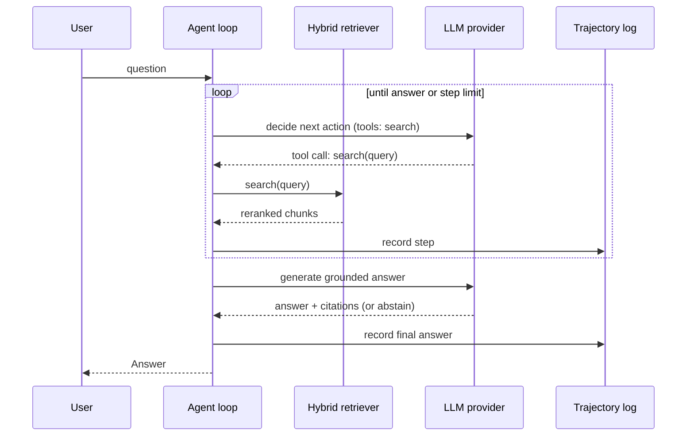

# Architecture

This document describes the *planned* system. At Milestone 1 only the package
skeleton, core models and settings exist; every box below is a placeholder
until its milestone lands. See the roadmap in the README for status.

## System overview

```mermaid
flowchart LR
    subgraph Ingestion["Ingestion (M2)"]
        RAW[Raw documents] --> LOAD[Loaders]
        LOAD --> CHUNK[Structure-aware chunking]
        CHUNK --> META[Metadata + dedup]
    end

    subgraph Index["Indexing (M3)"]
        META --> EMB[Embedder<br/>sentence-transformers]
        EMB --> VS[(Vector store)]
        META --> BM25[(BM25 index)]
    end

    subgraph Retrieval["Retrieval (M3)"]
        Q[Query] --> VSEARCH[Vector search]
        Q --> LSEARCH[Lexical search]
        VS --> VSEARCH
        BM25 --> LSEARCH
        VSEARCH --> RRF[RRF fusion]
        LSEARCH --> RRF
        RRF --> RERANK[Cross-encoder reranker]
    end

    subgraph Agent["Agent (M6)"]
        USER[User question] --> LOOP[Tool-using agent loop]
        LOOP -- search tool --> Q
        RERANK --> LOOP
        LOOP --> REWRITE[Query rewriting]
        REWRITE --> LOOP
        LOOP --> GEN[Grounded generation<br/>citations + abstention  M4]
    end

    GEN --> ANSWER[Answer + citations]

    subgraph LLM["LLM layer (M4)"]
        PROVIDER[Provider interface] --> ANTHROPIC[Anthropic async client<br/>retries, timeouts]
    end
    LOOP -.-> PROVIDER
    GEN -.-> PROVIDER

    subgraph Evaluation["Evaluation + data quality (M5, M7)"]
        SETS[(Versioned eval sets)] --> RMETRICS[Retrieval metrics<br/>recall@k, MRR, nDCG]
        SETS --> GMETRICS[Generation checks<br/>faithfulness, citations]
        GMETRICS --> JUDGE[LLM judge<br/>bias mitigation]
        JUDGE --> AGREE[Judge vs human<br/>Cohen's kappa]
        RMETRICS --> CI[Bootstrap CIs]
        JUDGE --> CI
        LOOP --> TRAJ[Trajectory logs] --> PASSK[pass@k / pass^k] --> CI
    end

    RERANK -.-> RMETRICS
    ANSWER -.-> GMETRICS

    subgraph Infra["Infrastructure (M8)"]
        API[FastAPI service]
        OBS[Structured logging + tracing]
        BATCH[Async batch runner]
        DOCKER[Docker]
    end
```

## Layer responsibilities

| Package | Responsibility | Milestone |
| --- | --- | --- |
| `ragplatform.config` | Settings from environment / `.env` via pydantic-settings | M1 |
| `ragplatform.models` | `Document`, `Chunk`, `RetrievedChunk`, `Citation`, `Answer` | M1 |
| `ragplatform.ingestion` | Loaders, structure-aware chunking, metadata, dedup | M2 |
| `ragplatform.retrieval` | Embedder interface, vector store, BM25, RRF fusion, reranking | M3 |
| `ragplatform.llm` | Provider protocol, async Anthropic client with retries, fake provider for tests | M4 |
| `ragplatform.evals` | Retrieval and generation metrics, LLM judge, pass@k / pass^k, bootstrap CIs | M5, M6 |
| `ragplatform.agent` | Tool-using loop, query rewriting, step limits, trajectory logging | M6 |
| `ragplatform.data_quality` | Failure taxonomy, annotation export, Cohen's kappa, judge-human agreement | M7 |
| `ragplatform.pipelines` | Dataset versioning, experiment runs, async batch runner | M8, M9 |
| `ragplatform.api` | FastAPI service | M8 |
| `ragplatform.observability` | structlog configuration and tracing | M8 |

## Key design decisions

**Models are the contract.** Every layer consumes and produces the pydantic
models in `ragplatform.models`. They are frozen and forbid unknown fields, so a
schema drift is caught at the boundary rather than deep inside a pipeline.

**The LLM is behind an interface.** Only `ragplatform.llm` imports the Anthropic
SDK. Everything else depends on a small protocol, which makes unit tests
deterministic (a fake provider) and keeps vendor swaps cheap.

**Embeddings default to local.** The base retrieval path uses a local
sentence-transformers model so the project runs end to end with only an
Anthropic key, and retrieval evaluation runs with no key at all.

**Heavy dependencies are extras.** `uv sync` installs only pydantic, the
Anthropic SDK and structlog. `retrieval`, `eval` and `api` extras pull in
torch-sized packages only when needed.

**Retrieval and generation are evaluated separately.** A wrong answer can come
from a retrieval miss or a generation failure; the metrics must tell which. See
the evaluation philosophy in the README.

## Request flow (planned)


