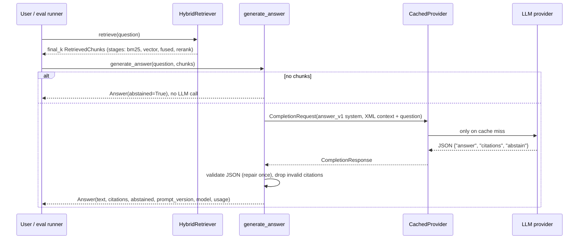

# Architecture

Milestones 1 to 5 are implemented: ingestion, indexing, hybrid retrieval with
reranking, grounded generation, and the evaluation harness. The agent loop
(M6), data-quality tooling (M7), infrastructure (M8) and experiments (M9) are
still placeholders. See the roadmap in the README for status.

## System overview

```mermaid
flowchart LR
    subgraph Corpus["Corpus (M2)"]
        PEPS[python/peps @ pinned commit] -->|rag download-corpus| RAW[data/raw/peps/*.rst + manifest.json]
        FIX[tests/fixtures/corpus] -.-> RAW
    end

    subgraph Ingestion["Ingestion (M2): rag ingest"]
        RAW --> LOAD[Loaders: .rst .md .txt<br/>title + heading hierarchy]
        LOAD --> CHUNK[Structure-aware chunker<br/>sections > paragraphs > sentences<br/>token budget + overlap]
        CHUNK --> DEDUP[Dedup: sha256 exact,<br/>MinHash LSH near-duplicates]
        DEDUP --> DS[(data/processed/&lt;dataset_version&gt;/<br/>chunks.jsonl + manifest.json)]
    end

    subgraph Index["Indexing (M3): rag index"]
        DS --> EMB[Embedder<br/>bge-small-en-v1.5] --> VS[(vectors_&lt;model&gt;.npz<br/>numpy exact cosine)]
        DS --> BM25[(bm25.json<br/>identifier-preserving tokenizer)]
    end

    subgraph Retrieval["Retrieval (M3): configs/*.yaml"]
        Q[Query] --> VSEARCH[Vector search]
        Q --> LSEARCH[BM25 search]
        VS --> VSEARCH
        BM25 --> LSEARCH
        VSEARCH --> RRF[RRF fusion k=60]
        LSEARCH --> RRF
        RRF --> RERANK[Cross-encoder reranker<br/>ms-marco-MiniLM-L-6-v2]
        RERANK --> TOPK[final_k RetrievedChunks<br/>with per-stage scores]
    end

    subgraph Generation["Generation (M4): rag query"]
        TOPK --> PROMPT[answer_v1 prompt<br/>XML chunk blocks + question]
        PROMPT --> STRUCT[JSON output validated<br/>with pydantic, 1 repair retry]
        STRUCT --> CHECK[Citation validation<br/>abstain on empty retrieval]
        CHECK --> ANSWER[Answer: text, citations,<br/>abstained, prompt_version, model, usage]
    end

    subgraph LLM["LLM layer (M4)"]
        PROVIDER[LLMProvider protocol] --> ANTHROPIC[AnthropicProvider<br/>async, SDK retries]
        PROVIDER --> FAKE[FakeProvider<br/>tests + --mock-llm]
        CACHE[CachedProvider<br/>data/cache/llm/&lt;sha256&gt;.json] --> PROVIDER
    end
    STRUCT -.-> CACHE

    subgraph Evaluation["Evaluation harness (M5): rag eval ..."]
        TAX[eval_sets/taxonomy_v1.yaml] --> CAND[generate-candidates<br/>stratified chunks -> LLM]
        CAND --> REVIEW[review: accept / edit / reject<br/>resumable]
        REVIEW --> SETS[(eval_sets/v1/items.jsonl<br/>labels = doc_id + section_path)]
        SETS --> RUN[run: retrieval metrics,<br/>programmatic checks, judges]
        TOPK -.-> RUN
        ANSWER -.-> RUN
        RUN --> JUDGE[Judges: faithfulness,<br/>correctness, relevance]
        JUDGE -.-> CACHE
        RUN --> BOOT[Bootstrap 95% CIs]
        BOOT --> OUT[(experiments/runs/&lt;ts&gt;_&lt;config&gt;/<br/>config, results.jsonl, summary.json, report.md)]
        OUT --> CMP[compare: paired bootstrap deltas]
    end

    subgraph Planned["Planned"]
        AGENT[Agent loop, pass@k / pass^k  M6]
        DQ[Failure taxonomy, Cohen's kappa  M7]
        INFRA[Batch runner, tracing, FastAPI, Docker  M8]
        EXP[Chunking / hybrid / rerank ablations  M9]
    end
```



## Layer responsibilities

| Package | Responsibility | Milestone | Status |
| --- | --- | --- | --- |
| `ragplatform.config` | Settings from environment / `.env` via pydantic-settings | M1 | done |
| `ragplatform.models` | `Document`, `Chunk`, `RetrievedChunk` (+ per-stage scores), `Citation`, `TokenUsage`, `Answer` | M1, M3, M4 | done |
| `ragplatform.ingestion` | Corpus download, loaders, chunking, dedup, versioned datasets | M2 | done |
| `ragplatform.retrieval` | Embedder, vector store, BM25, RRF, reranker, `HybridRetriever`, index build/load | M3 | done |
| `ragplatform.llm` | Provider protocol, Anthropic client, fake provider, disk cache, structured output, pricing | M4 | done |
| `ragplatform.prompts` | Versioned prompt files (`answer_v1`, `judge_*_v1`, `generate_candidates_v1`) | M4, M5 | done |
| `ragplatform.generation` | Grounded answers with citations and abstention | M4 | done |
| `ragplatform.pipelines` | `RunConfig` YAML (retrieval + generation + judge) | M3 | partial |
| `ragplatform.evals` | Eval items, taxonomy, metrics, checks, judges, bootstrap, candidates, review, runner, compare | M5 | done |
| `ragplatform.cli` | The `rag` typer CLI | M2-M5 | done |
| `ragplatform.agent` | Tool-using loop, query rewriting, step limits, trajectory logging | M6 | planned |
| `ragplatform.data_quality` | Failure taxonomy, annotation export, Cohen's kappa, judge-human agreement | M7 | planned |
| `ragplatform.api` | FastAPI service | M8 | planned |
| `ragplatform.observability` | structlog configuration and tracing | M8 | planned |

## Key design decisions

**Models are the contract.** Every layer consumes and produces the pydantic
models in `ragplatform.models`. They are frozen and forbid unknown fields, so a
schema drift is caught at the boundary rather than deep inside a pipeline.
`Chunk.metadata` stays a free-form dict at the boundary, with a typed view
(`ChunkMetadata`) for the fields the chunker writes.

**Everything is versioned by content.** Document ids are hashes of normalized
text; a dataset version hashes the input files plus the chunking and dedup
config; an eval set version hashes `items.jsonl`; prompts are files named by
version. A run records all four plus the git commit, so any number can be
traced back to exactly what produced it.

**Offsets, not copies.** Chunks carry `char_start` / `char_end` into the
normalized document, and `document.content[char_start:char_end] ==
chunk.content` always holds. Display and generation use the original text; only
embedding and BM25 see the contextual header (`title > section path`).

**Relevance labels are sources, not chunk ids.** Eval items point at
`doc_id + section_path`. A chunk is relevant when its document matches and its
section equals or is nested under the labeled one, so labels survive any
re-chunking. See `docs/evaluation.md`.

**Retrieval stages stay visible.** Every `RetrievedChunk` records the score and
rank it got from BM25, vector search, fusion and reranking, so a miss can be
attributed to the stage that dropped the chunk.

**The LLM is behind an interface.** Only `ragplatform.llm.anthropic_provider`
imports the Anthropic SDK. Everything else depends on `LLMProvider`, which is
what makes unit tests deterministic (`FakeProvider`) and lets a disk cache wrap
any provider transparently. Structured outputs are plain JSON validated with
pydantic plus one repair retry, so the same path works for the fake provider.

**Embeddings and reranking default to local models.** The project runs end to
end with only an Anthropic key, and retrieval evaluation runs with no key at all.
Heavy dependencies (`sentence-transformers`, torch) live behind the `retrieval`
extra; numpy, rank-bm25 and datasketch are light enough to sit in the base
install so CI can test the vector store, BM25 and dedup without model downloads.

## Request flow (M4, single-shot; the agent loop is M6)



## On-disk layout

```
data/raw/peps/                       downloaded corpus + manifest.json (gitignored)
data/processed/<dataset_version>/    chunks.jsonl, manifest.json, index/bm25.json, index/vectors_<model>.npz
data/cache/llm/<sha256>.json         cached LLM responses keyed by the full request
eval_sets/taxonomy_v1.yaml           question taxonomy
eval_sets/candidates/<ts>.jsonl      synthetic candidates (+ .review.json resume state)
eval_sets/<name>/items.jsonl         reviewed eval items + manifest.json
experiments/runs/<ts>_<config>/      config.json, results.jsonl, summary.json, report.md
configs/*.yaml                       run configs; configs/pricing.yaml for cost estimates
```
