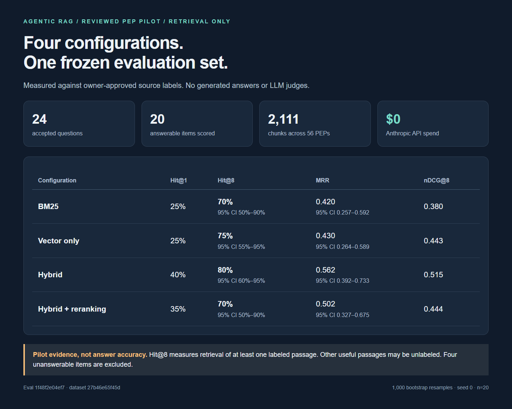
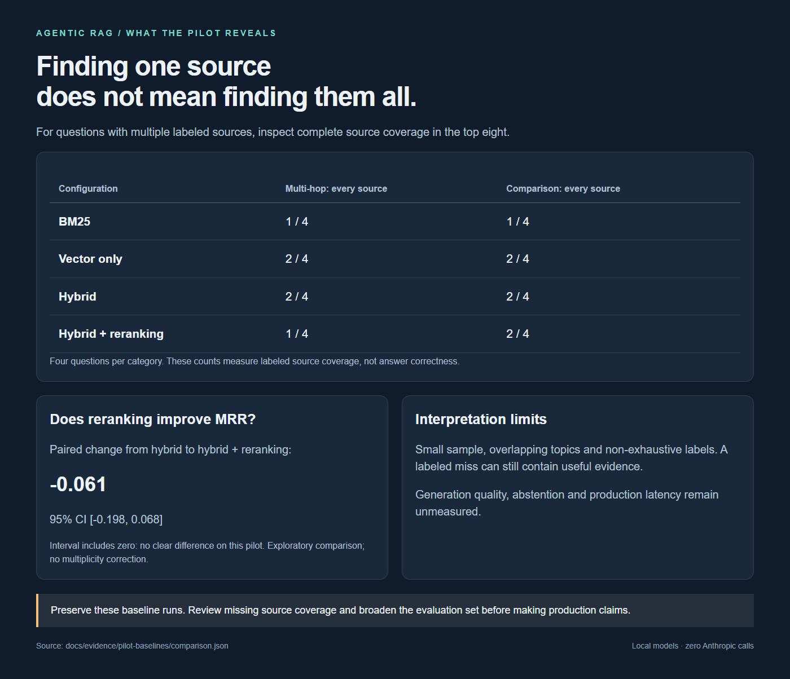

# Reviewed PEP pilot: retrieval baselines

24 owner-approved questions; retrieval metrics use the 20 answerable items.
Four unanswerable items are excluded from these scores. Generation and abstention
were not evaluated. All four runs made **zero Anthropic calls**.

Dataset `27b46e65f45d`; evaluation set `v1@1f48f2e04ef7`.

## Measured results

Hit@8 means at least one labeled passage appears in the top eight results.
It is not answer accuracy. MRR measures the rank of the first labeled passage.
The 24 common item IDs include four unanswerable items; each metric uses n=20.

| Configuration | Hit@1 | Hit@8 (95% CI) | MRR (95% CI) | nDCG@8 | Recall@8 |
|---|---:|---:|---:|---:|---:|
| bm25_only | 0.250 | 0.700 [0.500, 0.900] | 0.420 [0.257, 0.592] | 0.380 | 0.490 |
| vector_only | 0.250 | 0.750 [0.550, 0.950] | 0.430 [0.264, 0.589] | 0.443 | 0.606 |
| hybrid | 0.400 | 0.800 [0.600, 0.950] | 0.562 [0.392, 0.733] | 0.515 | 0.639 |
| hybrid_rerank | 0.350 | 0.700 [0.500, 0.900] | 0.502 [0.327, 0.675] | 0.444 | 0.557 |

## Paired comparisons

95% percentile bootstrap, 1,000 resamples, seed 0.
Exploratory intervals on this pilot; no multiple-comparison correction.

```text
A = 20261005T030406Z_bm25_only
B = 20261005T033932Z_vector_only
common items: 24

metric                       A       B  delta (B-A)             95% CI  verdict
hit@1                    0.250   0.250       +0.000 [ -0.200,  +0.200]  not distinguishable from noise
hit@8                    0.700   0.750       +0.050 [ -0.100,  +0.200]  not distinguishable from noise
mrr                      0.420   0.430       +0.010 [ -0.158,  +0.200]  not distinguishable from noise
ndcg@8                   0.380   0.443       +0.063 [ -0.090,  +0.235]  not distinguishable from noise
precision@8              0.106   0.131       +0.025 [ -0.013,  +0.062]  not distinguishable from noise
recall@8                 0.490   0.606       +0.115 [ -0.075,  +0.306]  not distinguishable from noise
```

```text
A = 20261005T030406Z_bm25_only
B = 20261005T033936Z_hybrid
common items: 24

metric                       A       B  delta (B-A)             95% CI  verdict
hit@1                    0.250   0.400       +0.150 [ -0.050,  +0.350]  not distinguishable from noise
hit@8                    0.700   0.800       +0.100 [ +0.000,  +0.250]  not distinguishable from noise
mrr                      0.420   0.562       +0.143 [ -0.011,  +0.305]  not distinguishable from noise
ndcg@8                   0.380   0.515       +0.135 [ +0.036,  +0.262]  distinguishable from noise
precision@8              0.106   0.138       +0.031 [ +0.013,  +0.056]  distinguishable from noise
recall@8                 0.490   0.639       +0.149 [ +0.033,  +0.292]  distinguishable from noise
```

```text
A = 20261005T030406Z_bm25_only
B = 20261005T033941Z_hybrid_rerank
common items: 24

metric                       A       B  delta (B-A)             95% CI  verdict
hit@1                    0.250   0.350       +0.100 [ -0.100,  +0.300]  not distinguishable from noise
hit@8                    0.700   0.700       +0.000 [ -0.200,  +0.200]  not distinguishable from noise
mrr                      0.420   0.502       +0.082 [ -0.072,  +0.238]  not distinguishable from noise
ndcg@8                   0.380   0.444       +0.064 [ -0.070,  +0.194]  not distinguishable from noise
precision@8              0.106   0.113       +0.006 [ -0.031,  +0.037]  not distinguishable from noise
recall@8                 0.490   0.557       +0.067 [ -0.133,  +0.250]  not distinguishable from noise
```

```text
A = 20261005T033936Z_hybrid
B = 20261005T033941Z_hybrid_rerank
common items: 24

metric                       A       B  delta (B-A)             95% CI  verdict
hit@1                    0.400   0.350       -0.050 [ -0.250,  +0.150]  not distinguishable from noise
hit@8                    0.800   0.700       -0.100 [ -0.250,  +0.000]  not distinguishable from noise
mrr                      0.562   0.502       -0.061 [ -0.198,  +0.068]  not distinguishable from noise
ndcg@8                   0.515   0.444       -0.071 [ -0.189,  +0.039]  not distinguishable from noise
precision@8              0.138   0.113       -0.025 [ -0.062,  +0.006]  not distinguishable from noise
recall@8                 0.639   0.557       -0.082 [ -0.242,  +0.042]  not distinguishable from noise
```

## Multi-source diagnostic

Counts questions whose top eight results cover every labeled source location.
This tests evidence coverage, not whether the answer is correct.

| Configuration | Multi-hop: all sources | Comparison: all sources |
|---|---:|---:|
| bm25_only | 1/4 | 1/4 |
| vector_only | 2/4 | 2/4 |
| hybrid | 2/4 | 2/4 |
| hybrid_rerank | 1/4 | 2/4 |

## Findings and recommended next step

Hybrid has the highest observed hit@8 (16/20) and MRR, but its hit@8/MRR improvements
over BM25 do not exclude zero in the paired 95% intervals. Some other exploratory
metrics favor hybrid; these are not corrected for multiple comparisons.

Reranking lowers observed hit@8 from 16/20 to 14/20. Its paired MRR change is
-0.061, with interval [-0.198, 0.068]; this is not evidence of a reliable regression.

**Confirmed label blind spot:** for `pilot-003`, BM25 retrieves PEP 655's Specification
at rank 2, which explicitly defines Required and NotRequired. The accepted label names
only its Abstract, so the scorer records a miss. The full passage and metadata are in
[the evidence record](evidence/pilot-baselines/label-coverage-example.json).

Before choosing a configuration or starting the agent phase, review pooled retrieved
passages from all four systems for additional relevant sources. Review them without
system/rank identifiers where practical, version the revised labels separately, and
rescore these saved rankings without model/API calls. Then expand the small pilot.

No labels or retrieval defaults were changed in response to these scores.


## Reproduction and limits

Runs used BAAI/bge-small-en-v1.5 and cross-encoder/ms-marco-MiniLM-L-6-v2
from the local cache, with Hugging Face/Transformers offline mode enabled.
Candidate pool 50, final k=8, RRF k=60; existing configs were not tuned to results.
The embedding query prefix was empty, matching the existing default.
Model revisions and file hashes are recorded in provenance.json.

This small pilot has overlapping topics, source labels that are not exhaustive,
and easy out-of-domain negatives. A miss can retrieve useful but unlabeled text.
Chunk recall penalizes retrieving only part of a labeled multi-chunk section.
Bootstrap intervals assume independent items; topical overlap weakens that assumption.
Do not interpret these scores as production readiness or broad statistical proof.
Labels were frozen before baseline execution; no labels were changed to improve scores.

## Run IDs

- `20261005T030406Z_bm25_only` — [raw report](evidence/pilot-baselines/bm25_only/report.md)
- `20261005T033932Z_vector_only` — [raw report](evidence/pilot-baselines/vector_only/report.md)
- `20261005T033936Z_hybrid` — [raw report](evidence/pilot-baselines/hybrid/report.md)
- `20261005T033941Z_hybrid_rerank` — [raw report](evidence/pilot-baselines/hybrid_rerank/report.md)

## Showcase screenshots





Screenshots of the local report; not a deployed application.

Follow-up: [offline label sensitivity diagnostic](label-sensitivity.md) preserves these baseline scores and measures one proposed annotation change.
