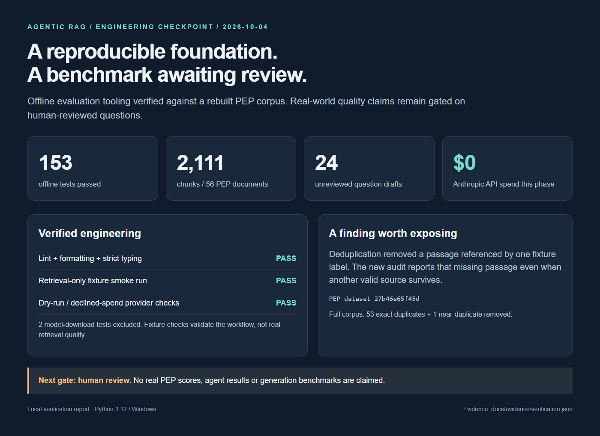
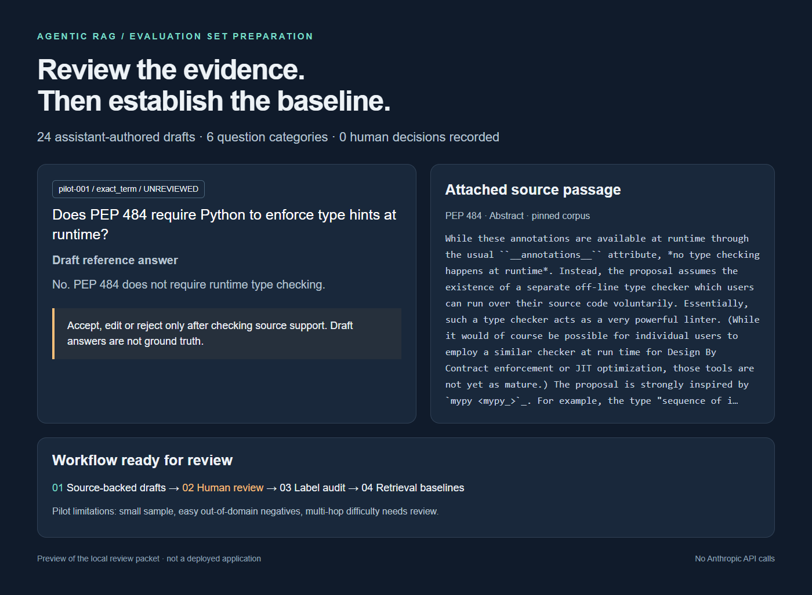

# Evaluation preparation checkpoint — 2026-10-04

**Historical preparation snapshot:** the owner has since accepted pilot v2.
See [the reviewed baseline report](baseline-results.md) for the subsequent results.
The pending-review statements and screenshots below describe the earlier checkpoint.

The offline workflow is verified. The real benchmark is **pending human review**.
No Anthropic API calls were made during this phase. M6 has not started.

## Verified results

- Rebuilt the pinned 56-document corpus into 2,111 chunks, dataset `27b46e65f45d`.
- Removed 53 exact duplicates and one near-duplicate, reproducing the original dataset.
- Full fast suite: **153 passed, 2 deselected** on Python 3.12 / Windows.
- Ruff lint and formatting passed; strict mypy passed for 100 source files.
- A retrieval-only fixture smoke run completed with zero LLM calls and zero item errors:
  `20261005T021647Z_bm25_only` (UTC). Artifacts: `docs/evidence/fixture-smoke/`.
  This is a five-item artificial fixture, **not a PEP benchmark**. Do not use its scores
  as evidence of real retrieval quality.

## Added in this phase

- `rag eval generate-candidates --dry-run` previews call counts and approximate cost
  without constructing an LLM provider. Real candidate generation now requires confirmation
  or `--yes`. The estimate uses configured prices, maximum output allowances and one repair
  allowance; it is not an enforced dollar cap. Verify model/prices before any paid run.
- `rag eval audit` checks duplicate questions/IDs, category coverage and source matching.
  Missing alternative sources are warnings if another source matches; missing evidence
  for multi-hop/comparison items is an error. These checks do not establish label quality.
- `rag eval baseline` audits first and runs retrieval-only configurations. Defaults to BM25;
  accepts repeated `--config` arguments. It never creates an LLM provider.
- Candidate review now shows and preserves multiple supporting passages and documents.
- A 24-question assistant-authored pilot, four drafts per category, with pinned source
  passages. These are unreviewed candidates, not evaluation items.

## Important finding

The fixture's conceptual question labels two near-duplicate rationale passages. Deduplication
removes one, leaving another valid passage. The previous aggregate label check did not expose
the removed individual source. The new audit reports it explicitly.

## Human review is the next gate

The active draft is **pilot v2**, revised for simpler wording and narrower answers.
Start with [the concise list](pilot-questions.md); [the full packet](pilot-review.md)
contains supporting passages. The earlier v1 candidates are retained only for history.
Accept, edit or reject each draft:

```bash
uv run rag eval review eval_sets/candidates/pilot_v2.jsonl --eval-set v1
uv run rag eval audit --eval-set v1 --dataset-version 27b46e65f45d
uv run rag eval baseline --eval-set v1 --dataset-version 27b46e65f45d
```

Do not bulk-accept without checking source support. Verify that multi-hop drafts actually
require multiple passages; several may need revision or reclassification. The unanswerable
drafts are easy out-of-domain cases, not adversarial near-misses. The pilot covers a subset
of the corpus and is too small for strong conclusions. Expand toward 60–100 reviewed questions
with harder negatives and broader coverage afterward.

For all four retrieval variants, install the retrieval extra and build local model indexes,
then run this **only after review** (no Anthropic calls; local model downloads required):

```bash
uv sync --extra retrieval
uv run rag index --dataset-version 27b46e65f45d
uv run rag eval baseline --eval-set v1 --dataset-version 27b46e65f45d \
  --config configs/bm25_only.yaml --config configs/vector_only.yaml \
  --config configs/hybrid.yaml --config configs/hybrid_rerank.yaml
uv run rag eval compare <baseline-run-directory> <candidate-run-directory>
```

No real PEP quality scores, generation scores or hybrid/reranking comparisons are claimed yet.
No paid run has been approved. The reviewed set remains absent until human review decisions.

## Showcase assets





These are browser screenshots of the local checkpoint report and candidate preview,
not a deployed product. HTML sources are retained under `docs/showcase/`.
Screenshots label the pending review gate and do not present fixture scores as benchmarks.
